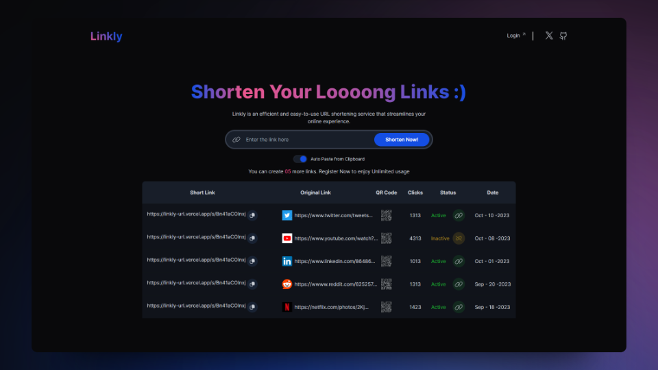

<div align="center">
<a href="https://Linkly.app">

</a>
<p></p>
</div>

<div align="center">


</div>

## 🛠️ Stack

- [**Typescript**](https://www.typescriptlang.org/) - JavaScript with syntax for types.
- [**Tailwindcss**](https://tailwindcss.com/) - A utility-first CSS framework for rapidly building custom designs.
- [**clsx**](https://github.com/lukeed/clsx) + [**tailwind-merge**](https://github.com/dcastil/tailwind-merge) inspired by [shadcn/ui](https://ui.shadcn.com) - A tiny utility for constructing `className` strings conditionally.
- [**Prettier**](https://prettier.io/) + [prettier-plugin-tailwindcss](https://github.com/tailwindlabs/prettier-plugin-tailwindcss) - An opinionated code formatter.
- [**Sonner**](https://github.com/wobsoriano/svelte-sonner) - An opinionated toast component for React.

## 🚀 Getting Started

You will need:

- [Node.js 16+ (recommended 18 LTS)](https://nodejs.org/en/).
- [Git](https://git-scm.com/).

1. [Fork](https://github.com/Edu4r0/Linkly/fork) this repository and clone it locally:

```bash
git clone git@github.com:your_username/Linkly.git
```

2. Install dependencies:

```bash
# Install pnpm globally if you don't have it:
npm install -g pnpm

# and install dependencies:
pnpm install
```
## ✌️ Contributing

<a href="https://github.com/Edu4r0/Linkly/graphs/contributors">
  
</a>

<p></p>

## 🔑 License

- [MIT](https://github.com/Edu4r0/Linkly/blob/main/LICENSE).